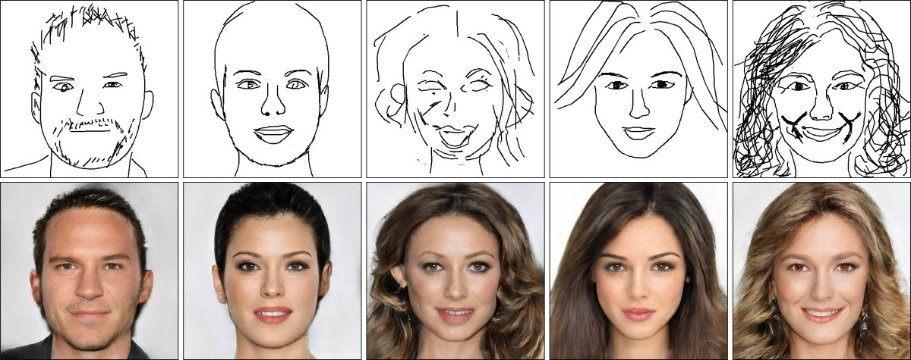

% Hightlights from Modern Neural Network Architectures
% Patryk Kocielnik
% June 2020

# Available formats and code

Feel free to download this book in [PDF](http://mnna.kocielnik.pl/mnna.pdf) or
[EPUB](http://mnna.kocielnik.pl/mnna.epub).

See the source code accompanying this book at [this
URL](https://gitlab.com/kocielnik/neural-network-architectures).

Review the manuscript [here](https://github.com/kocielnik/mnna).

# Goal

I am currently searching for a way to explore how human cognition and origins
work, through empirical studies and quantitative comparison.

> Our main goal is developing a computationally based understanding of human
> intelligence and establishing an engineering practice based on that
> understanding.

-- Tagline of the research group Center for Brains, Minds and Machines of
CSAIL, MIT,
[website](https://www.csail.mit.edu/research/center-brains-minds-and-machines#projects)

This lies in accordance with the goals of the Center for Brains, Minds and
Machines research group on MIT, whose tagline is quoted above.

The Center for Brains, Minds and Machines posts a part of its know-how
publically on-line under the address [^github_cbmm].

[^github_cbmm]: [CBMM on GitHub](https://github.com/CBMM)

> [This course series] is designed to help you learn about progress toward the
> scientific goal of understanding human intelligence from a computational
> point of view. The foundations for 6.xxx were developed by a group that
> styles itself as The Human Intelligence Enterprise, from which this subject
> draws its name.

-- [^mit_ocw_human-intelligence]

[^mit_ocw_human-intelligence]: The Human Intelligence Enterprise, Electrical
  Engineering and Computer Science faculty, MIT,
  [source](http://ocw2.mit.edu/courses/electrical-engineering-and-computer-science/6-803-the-human-intelligence-enterprise-spring-2006/syllabus/)

> You should take 6.xxx if you want to learn about the enterprise of explaining
> intelligence from a computational point of view. When you have finished the
> subject, you will understand the powerful ideas behind an optimistic view of
> what will be discovered in the next decade.

-- [^mit_ocw_human-intelligence]

> Upon completion of 6.034, students should be able to develop intelligent
> systems by assembling solutions to concrete computational problems;
> understand the role of knowledge representation, problem solving, and
> learning in intelligent-system engineering; and appreciate the role of
> problem solving, vision, and language in understanding human intelligence
> from a computational perspective.

-- [^mit_artificial-intelligence_2010]: MIT OCW course card [Artificial
Intelligence](http://ocw2.mit.edu/courses/electrical-engineering-and-computer-science/6-034-artificial-intelligence-fall-2010/)

Similar research around the globe

> There is a golden opportunity within reach, the kind of opportunity that
> comes along just a few times in a century. That opportunity is to bring
> together people dedicated to understanding human intelligence from the neuron
> level up to the manifestation of behavior.

-- The Human Intelligence Enterprise manifesto, MIT [^hie]

[^hie]: The Human Intelligence Enterprise, MIT, [link](http://groups.csail.mit.edu/genesis/HIE/)

> We are on the verge of discoveries about human intelligence that are as
> important to understanding the way we think as the discovery of the structure
> of DNA was to molecular biology. Such discoveries can be made only once in
> the history of our species. We believe they can be made during the coming
> decade.

-- The Human Intelligence Enterprise manifesto, MIT [^hie]

# Content

This book includes 12 neural network-related exercises done and discussed. You
will start from the most basic experiments with binary neural nets. In the end,
you will learn about one-shot object recognition from images.

The key aspect of those experiments will be the input that is needed for them
to work, the output they generate, and comparative analysis of the output with
what we may encounter in the everyday world, to which we will also refer to
under the name "nature".

# Introduction - Why neural networks

> One of the most striking facts about neural networks is that they can compute
> any function at all. That is, suppose someone hands you some complicated,
> wiggly function, f(x), no matter what the function, there is guaranteed to be
> a neural network so that for every possible input, xx, the value f(x)f(x) (or
> some close approximation) is output from the network.

-- On the versatility of neural network models, Michael Nielsen, [A visual
proof that neural nets can compute any
function](http://neuralnetworksanddeeplearning.com/chap4.html)

Statistical thinking enables us to see patterns we would never see otherwise.

> Imagine if all our scientific theories and models told us only about
> averages: if the best weather forecasts could only give you the average daily
> amount of rain expected over the next month, or if astronomers could only
> predict the average time between solar eclipses.
>
> In the early days of quantum mechanics, that seemed to be its inevitable
> limitation: It was a probabilistic theory, telling us only what we will
> observe on average if we collect records for many events or particles. To
> Erwin Schrödinger, whose eponymous equation prescribes how quantum objects
> behave, it was utterly meaningless to think about specific atoms or electrons
> doing things in real time.

-- How "God does not play dice" after all [^quanta_trajectory_theory]

> Great minds see analogies between analogies.

-- S. Banach

Analogies between objects take the form of the *properties* of those objects.
Analogies between analogies concern the ways those properties are formed. What
form the "ways" take? They can be likened to *functions* generating object with
such properties, and functions have their *derivatives*. Analogies, then, take
the form of derivatives!

Others talk about "mathematical beauty" or "beautiful symmetry" in mathematics.
Is it not the exactly same thing they are all searching for?

> [The method of mathematical reason would] “…enable[s] one to infer results
> about experiments that have not been performed. There is no logical reason
> why the […] method should be possible at all, but one has found in practice
> that it does work and meets with reasonable success. This must be ascribed to
> some mathematical quality in Nature, a quality which the casual observer of
> Nature would not suspect, but which nevertheless plays an important role in
> Nature’s scheme.”

-- Paul Dirac, 1939,
[src](https://www.freecodecamp.org/news/connections-between-deep-learning-physics-and-pure-mathematics-part-i-947abeb3a5dd/)

> There are many examples in history where purely abstract mathematical
> concepts eventually led to powerful applications way beyond the context in
> which they were developed. This article is about one of those examples.

-- Marco Tavora, FreeCodeCamp,
[src](https://www.freecodecamp.org/news/connections-between-deep-learning-physics-and-pure-mathematics-part-i-947abeb3a5dd/)

# Algorithms

## Bayesian filtering

> Bayesian filter is one of the fundamental approach to estimate the
> distribution in a process where there is incoming measurements. It used to be
> widely used in localization problems in robotics.

-- [^bayesian_filtering]

[^bayesian_filtering]: https://leimao.github.io/article/Introduction-to-Bayesian-Filter/

## Back-propagation

> The backpropagation algorithm was originally introduced in the 1970s, but its
> importance wasn't fully appreciated until a famous 1986 paper by David
> Rumelhart, Geoffrey Hinton, and Ronald Williams.

-- On the origins of the back-propagation algorithm, Michael Nielsen, [How the
backpropagation algorithm
works](http://neuralnetworksanddeeplearning.com/chap2.html)

> We describe a new learning procedure, back-propagation, for networks of
> neurone-like units. The procedure repeatedly adjusts the weights of the
> connections in the network so as to minimize a measure of the difference
> between the actual output vector of the net and the desired output vector. As
> a result of the weight adjustments, internal ‘hidden’ units which are not
> part of the input or output come to represent important features of the task
> domain, and the regularities in the task are captured by the interactions of
> these units. The ability to create useful new features distinguishes
> back-propagation from earlier, simpler methods such as the
> perceptron-convergence procedure.

-- [Learning representations by back-propagating errors
](https://www.nature.com/articles/323533a0)

# Experiments

## Neural network from scratch

> Let’s build a neural network from scratch. Our artificial brain should run on
> just the core Haskell system.

‒ Ben Lynn [^lynn_neural]

## Recognizing handwriting

> It’s possible that the glass AI could eventually be used as a kind of
> “biometric lock”, he says. Individual glass AIs could be used for specific
> tasks, such as recognising a person’s face. “You will have lots of little,
> inexpensive, disposable smart things that work under extremely tight energy,
> bandwidth, and dollar budgets,” he says.

-- [^newscientist_ai_glass]

[^newscientist_ai_glass]: https://www.newscientist.com/article/2208975-ai-made-from-a-sheet-of-glass-can-recognise-numbers-just-by-looking/

Leibniz had the following idea:

1. Create a ‘universal language’ in which all possible problems can be stated.
2. Find a decision method to solve all the problems stated in the universal
   language.

These are cited after the Introduction to Lambda Calculus available
[here](https://www.researchgate.net/profile/Henk_hendrik_Barendregt/publication/215458960_Introduction_to_lambda_calculus/links/004635182bdcc3df8e000000/Introduction-to-lambda-calculus.pdf?origin=publication_detail).

When the problem of solving mathematical equations with neural networks

## Synthesizing music

A deep neural network model has been created by OpenAI. The model has been
called MuseNet and is able to generate 4-minute musical compositions with 10
different instruments. MuseNet can imitate the styles from country to the
Beatles to Mozart [^openai_musenet].

[^openai_musenet]: https://openai.com/blog/musenet/

## Synthesizing dream images

Here, we explore different artifacts in the area of reproducing human
cognition, together with their "creations" (that should be rather called
"compositions" for better clarity), and how they relate to human performance in
qualitative and quantitative aspects.

The graphic lambda calculus notation used in the discussion of the networks is
based on the model by Alan Turing from 1948, as mentioned
[here](https://chorasimilarity.wordpress.com/2013/06/26/teaser-b-type-neural-networks-in-graphic-lambda-calculus-i/).
The original technical report of Turing is available
[here](http://www.alanturing.net/turing_archive/archive/l/l32/L32-001.html).

> The distinctive property of deep learning is that it studies deep neural
> networks – neural networks with many layers. Over the course of multiple
> layers, these models progressively bend data, warping it into a form where it
> is easy to solve the given task.

-- Christopher Olah,
[blog](https://colah.github.io/posts/2015-09-NN-Types-FP/), 2015

Google Deep Dream Project, a whole gallery can be found
[here](https://photos.google.com/share/AF1QipPX0SCl7OzWilt9LnuQliattX4OUCj_8EP65_cTVnBmS1jnYgsGQAieQUc1VQWdgQ?key=aVBxWjhwSzg2RjJWLWRuVFBBZEN1d205bUdEMnhB).

Mathematically, is a neural network model anything else than just a combination
of instantaneous map and reduce operations? See [^map_reduce].

[^map_reduce]: Chu, "Map-Reduce for Machine Learning on Multicore", 2006

## Synthesizing faces

> Our DeepFaceDrawing system allows users with little training in drawing to
> produce high-quality face images (Bottom) from rough or even incomplete
> freehand sketches (Top). Note that our method faithfully respects user
> intentions in input strokes, which serve more like soft constraints to guide
> image synthesis.

‒ Deep Fakes, [^deep_face_drawing]

[^deep_face_drawing]: http://geometrylearning.com/DeepFaceDrawing/

> DEEP FAKES are both exciting and frightening. Check out the latest deep fake
> breakthrough that enables the creation of realistic faces using only simple
> sketches.

‒  Chadwick Turner, Emerging Tech Consultant [^deep_fakes]

[^deep_fakes]: Chadwick Turner, LinkedIn post message, 7.06.2020,
  [source](https://www.linkedin.com/posts/chadwickmturner_deepfakes-artificialintelligence-ai-activity-6675055186588913665-xXej)

## Language translation

> We’ve trained a large-scale unsupervised language model which generates
> coherent paragraphs of text, achieves state-of-the-art performance on many
> language modeling benchmarks, and performs rudimentary reading comprehension,
> machine translation, question answering, and summarization—all without
> task-specific training.
>
> Our model, called GPT-2 (a successor to GPT), was trained simply to predict
> the next word in 40GB of Internet text.

-- [^better_models]

[^better_models]: https://openai.com/blog/better-language-models/

> However, Pérez also pointed out that it is likely that the only way of
> knowing for sure if unicorns are indeed the descendants of a lost alien race
> is through DNA. “But they seem to be able to communicate in English quite
> well, which I believe is a sign of evolution, or at least a change in social
> organization,” said the scientist.

-- Machine-generated output [^better_models]

> As the above samples show, our model is capable of generating samples from a
> variety of prompts that feel close to human quality and show coherence over a
> page or more of text. Nevertheless, we have observed various failure modes,
> such as repetitive text, world modeling failures (e.g. the model sometimes
> writes about fires happening under water), and unnatural topic switching.
> Exploring these types of weaknesses of language models is an active area of
> research in the natural language processing community.

-- On the results of research, [^better_models]

# Architectures

## MRCNN

> Deep convolutional neural networks (DCNNs) perform on par or better than
> humans for image classification. Hence efforts have now shifted to more
> challenging tasks such as object detection and classification in images,
> video or RGBD.

-- Philippe Burlina, [MRCNN](https://ieeexplore.ieee.org/abstract/document/7900179)

The course from Fast.AI starts with Image classification. See [lesson
1](https://course.fast.ai/videos/?lesson=1).

## Attention mechanisms

1. OpenAI.com
2. Attention Mechanism Memory Network by SkyMind [^skymind_attention]

## Recurrent NNs

## Lottery ticket NNs

# More information

One of the best free courses in Deep Learning around is the one from Fast.AI.

> You might be surprised by what you don’t need to become a top deep learning
> practitioner. You need one year of coding experience, a GPU and appropriate
> software (see below), and that’s it. You don’t need much data, you don’t need
> university-level math, and you don’t need a giant data center.

‒ "Practical Deep Learning for Coders v. 3", Fast.AI course, [source](https://course.fast.ai/)

# References

1. HTML template from Stephen Diehl's "What I Wish I Had Known When Learning
   Haskell". (Thanks, Stephen!)
2. NN-SVG Neural Network image generation tool by Alex Lenail [^lenail_nnsvg]
3. Fast.AI Course in Deep Learning: [link](https://course.fast.ai/)
4. Neural Network from Scratch (in Haskell), Stanford Crypto, Ben Lynn [^lynn_neural]

# Links

[^lenail_nnsvg]: https://github.com/alexlenail/NN-SVG
[^lynn_neural]: https://crypto.stanford.edu/~blynn/haskell/brain.html
[^quanta_trajectory_theory]: https://www.quantamagazine.org/how-quantum-trajectory-theory-lets-physicists-understand-whats-going-on-during-wave-function-collapse-20190703/
[^skymind_attention]: https://skymind.ai/wiki/attention-mechanism-memory-network
